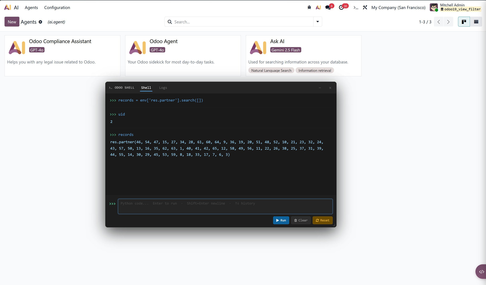
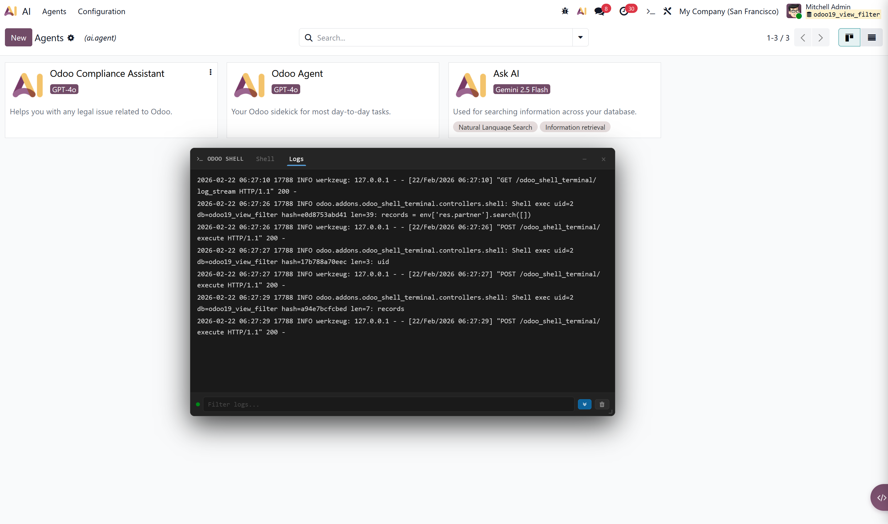

# Odoo Shell Terminal

**Version:** 19.0.1.0.0 | **License:** OPL-1 | **Author:** Mihran Thalhath

> Developed with the help of AI.

Browser-based Python shell and live log viewer for Odoo 19, accessible from the systray — no SSH or server access required.

---

## Table of Contents

- [Features](#features)
- [Warning](#-warning)
- [Installation](#installation)
- [Usage](#usage)
- [Configuration](#configuration)
- [Security](#security)
- [Limitations](#limitations)

---

## Features

| Feature | Description |
|---------|-------------|
| Interactive Shell | Execute Python against the live `env` directly from the browser |
| Persistent Session | `env`, `uid`, `user` pre-bound; namespace survives across executions |
| Auto-repr | Single expressions print their value without needing `print()` |
| Live Log Viewer | Real-time server logs via SSE — no page refresh needed |
| Color-coded Logs | DEBUG / INFO / WARNING / ERROR / CRITICAL color-coded |
| Rate Limiting | 30 executions per user per 60-second window |
| Audit Logging | All executed code logged with uid, db, and SHA-256 hash |
| Access Control | Requires Technical Administrator (`group_system`) — enforced by a server constraint |
| Debug-mode only | Systray icon only appears when Odoo is running in debug mode |

---

## ⚠️ Warning

The shell gives you **direct, unrestricted access to the Odoo ORM and the underlying PostgreSQL database**.

### Database changes require an explicit commit

The shell session uses its own long-lived cursor that is **not auto-committed**. Write operations — `create()`, `write()`, `unlink()`, or raw `env.cr.execute()` — **will not be persisted** until you explicitly call:

```python
env.cr.commit()
```

If you close or reset the session without committing, all changes are rolled back automatically.

### What can go wrong

- `env['res.partner'].search([]).unlink()` + `env.cr.commit()` = all partners deleted, no undo
- Forgetting to commit = writes silently disappear
- Committing mid-script = database left in a partially updated state

> **Grant this group only to trusted Technical Administrators. Do not enable on production systems unless you fully understand the consequences.**

---

## Installation

1. Copy or symlink `odoo_shell_terminal` into your Odoo addons path
2. Restart the Odoo server
3. Go to **Apps**, search for *Odoo Shell Terminal*, and install
4. Go to **Settings > Users**, edit the user, and assign the **Odoo Shell User** group
   - The user **must already be a Technical Administrator** — Odoo will raise a `ValidationError` if you try to assign the group to a non-admin user
5. Activate debug mode (`?debug=1`) — the systray icon is only visible in debug mode

---

## Usage

After installation, activate debug mode (`?debug=1`) and a terminal icon (`>_`) appears in the top-right systray. The icon is **intentionally hidden outside of debug mode** as an additional safety measure.

### Tabs

| Tab | Description |
|-----|-------------|
| Shell | Python REPL against the live `env` |
| Logs | Real-time server log stream |

### Screenshots

**Shell tab — Interactive Python REPL**


**Logs tab — Live server log stream**


### Shell examples

```python
# Query records
env['sale.order'].search([('state', '=', 'draft')], limit=5)

# Modify a record — must commit to persist
partner = env['res.partner'].browse(1)
partner.write({'name': 'Updated Name'})
env.cr.commit()  # required

# Raw SQL
env.cr.execute("SELECT id, name FROM res_partner LIMIT 5")
env.cr.fetchall()
```

Use **Reset Session** to clear the namespace and start a fresh cursor.

---

## Configuration

No config file needed. Tune behaviour by editing constants in `controllers/shell.py`:

| Constant | Default | Description |
|----------|---------|-------------|
| `SESSION_IDLE_TIMEOUT` | `600` s | Idle time before session eviction |
| `MAX_SESSIONS` | `3` | Max concurrent sessions (LRU eviction) |
| `MAX_CODE_LEN` | `10000` chars | Max code length per execution |
| `RATE_WINDOW_SECS` | `60` s | Rate-limit window |
| `RATE_MAX_REQUESTS` | `30` | Max executions per user per window |

---

## Security

| Group | XML ID | Prerequisite | Access |
|-------|--------|--------------|--------|
| Odoo Shell User | `odoo_shell_terminal.group_shell_terminal_user` | `base.group_system` (Technical Administrator) | Shell terminal + log viewer |

### How the prerequisite is enforced

A `@api.constrains` override on `res.users` raises a `ValidationError` at save time if you attempt to assign the **Odoo Shell User** group to a user who does not already belong to **Technical Administrator** (`base.group_system`). This is a hard server-side error — it cannot be bypassed from the UI.

```
ValidationError: User 'John' cannot be added to 'Odoo Shell User'
because they are not a Technical Administrator (Settings > Technical).
Grant Technical Administrator access first.
```

### Debug-mode visibility

Even for authorised users, the systray icon is only rendered when `this.env.debug` is truthy (i.e. `?debug=1` or `?debug=assets` in the URL). In normal mode the component returns nothing. All server-side checks remain active regardless.

Visible under **Settings > Users & Companies > Groups** in the *Shell Terminal* section.

---

## Limitations

- **Multi-worker:** Sessions are worker-bound. In multi-worker setups, requests may land on different workers, causing session loss. Use `--workers=1` or `gevent` during development.
- **Log viewer:** Only captures logs from the worker handling the SSE connection. Configure a shared `--logfile` to see all workers.
- **No autocomplete:** Syntax highlighting and autocomplete are not yet supported.

---
